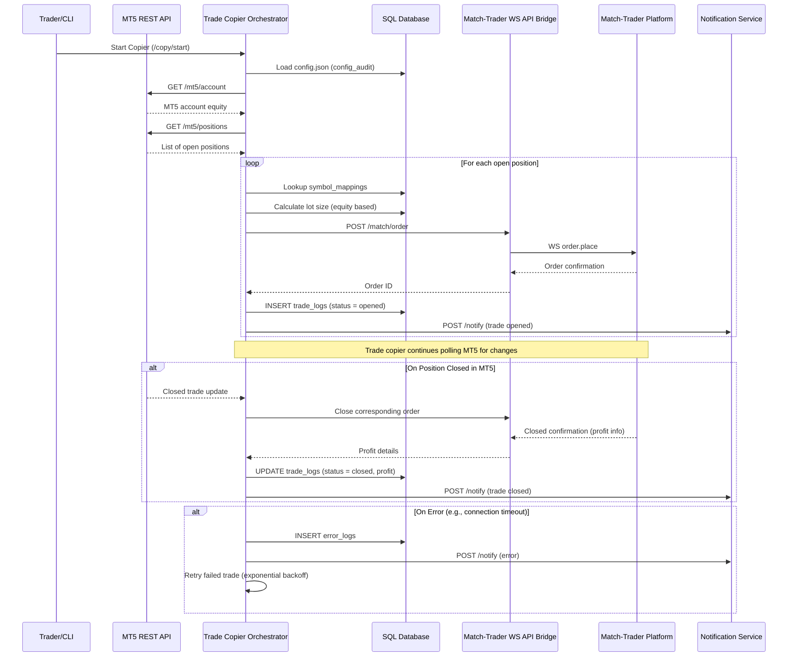

# MT5-Trader

Here’s a detailed **Mermaid sequence diagram** that illustrates the end-to-end flow for the **MT5 to Match-Trader Trade Copier** process.

This includes:

* MT5 Terminal exposing a REST API via a local Flask/FastAPI wrapper
* Trade Copier service (orchestrator)
* Match-Trader WebSocket bridge
* Database logging
* Notification subsystem

---

## 📈 Mermaid Sequence Diagram



---

## 🔍 Explanation of Key Events

| Step                 | Description                                                                           |
| -------------------- | ------------------------------------------------------------------------------------- |
| `Start Copier`       | CLI or cron job triggers the copier process                                           |
| `Load config.json`   | Configuration is parsed and stored in the `config_audit` table                        |
| `MT5 API calls`      | Local REST API fetches account info and open positions                                |
| `Symbol Mapping`     | Each MT5 symbol (e.g., `EURUSD.z`) is mapped to Match-Trader format (e.g., `EUR/USD`) |
| `Lot Sizing`         | Based on config: proportional, fixed, or equity-based calculation                     |
| `Match-Trader Order` | Trade command sent via WebSocket bridge to Match-Trader                               |
| `Trade Logging`      | Every successful trade is logged for audit and debugging                              |
| `Notifications`      | Alerts sent on success, errors, and trade closures                                    |
| `Error Handling`     | If WS or API fails, log and retry logic is executed                                   |

---

Would you like me to generate this diagram as a PNG or integrate it into your documentation scaffold?


Based on your PRD for the **MT5 to Match-Trader Trade Copier**, here’s a proposed **supported API specification** and a **database schema** that aligns with your requirements.

---

## ✅ API Support Specification

### 1. **MT5 API Integration**

MT5 will be accessed using the [MetaTrader5 Python package](https://pypi.org/project/MetaTrader5/), which communicates with the locally running terminal.

**Core Functions Used:**

* `MT5.initialize()`
* `MT5.positions_get()`
* `MT5.orders_get()`
* `MT5.copy_rates_from()`
* `MT5.order_send()`
* `MT5.shutdown()`

### 2. **Match-Trader API Integration**

Match-Trader uses **WebSocket API** for trade execution and management.

**Sample WebSocket Messages:**

#### Authenticate:

```json
{
  "type": "auth",
  "payload": {
    "token": "<JWT or API key>"
  }
}
```

#### Place Order:

```json
{
  "type": "order.place",
  "payload": {
    "symbol": "EUR/USD",
    "volume": 1.0,
    "side": "buy",
    "type": "market"
  }
}
```

#### Modify SL/TP:

```json
{
  "type": "order.modify",
  "payload": {
    "orderId": "<match_order_id>",
    "stopLoss": 1.0950,
    "takeProfit": 1.1050
  }
}
```

#### Order Status Events:

```json
{
  "type": "order.status",
  "payload": {
    "orderId": "12345",
    "status": "closed",
    "profit": 150.25
  }
}
```

---

## ✅ Database Schema

### 💾 Tables

#### `accounts`

| Column Name   | Type      | Description                       |
| ------------- | --------- | --------------------------------- |
| id            | UUID      | Primary key                       |
| account\_name | TEXT      | Friendly name                     |
| account\_type | TEXT      | 'MT5' or 'MatchTrader'            |
| login         | TEXT      | MT5 login ID or MatchTrader token |
| broker\_name  | TEXT      | e.g., FTUK, Lux, CTI              |
| base\_url     | TEXT      | Match-Trader endpoint (if known)  |
| equity        | FLOAT     | Cached value of account equity    |
| connected     | BOOLEAN   | Connection status                 |
| created\_at   | TIMESTAMP |                                   |

---

#### `symbol_mappings`

| Column Name   | Type      | Description      |
| ------------- | --------- | ---------------- |
| id            | UUID      | Primary key      |
| mt5\_symbol   | TEXT      | e.g., "EURUSD.z" |
| match\_symbol | TEXT      | e.g., "EUR/USD"  |
| created\_at   | TIMESTAMP |                  |

---

#### `trade_logs`

| Column Name      | Type      | Description                  |
| ---------------- | --------- | ---------------------------- |
| id               | UUID      | Primary key                  |
| source\_account  | UUID      | FK → accounts.id             |
| dest\_account    | UUID      | FK → accounts.id             |
| mt5\_order\_id   | TEXT      | Original MT5 order ID        |
| match\_order\_id | TEXT      | Mapped Match-Trader order ID |
| symbol           | TEXT      | Symbol traded                |
| side             | TEXT      | 'buy' or 'sell'              |
| volume           | FLOAT     | Volume copied                |
| status           | TEXT      | 'opened', 'closed', 'failed' |
| profit           | FLOAT     | Profit on close              |
| timestamp        | TIMESTAMP | Time of event                |

---

#### `error_logs`

| Column Name | Type      | Description                           |
| ----------- | --------- | ------------------------------------- |
| id          | UUID      | Primary key                           |
| account\_id | UUID      | FK → accounts.id                      |
| context     | TEXT      | Operation during which error occurred |
| message     | TEXT      | Error message                         |
| resolved    | BOOLEAN   | Whether it was retried and resolved   |
| timestamp   | TIMESTAMP |                                       |

---

#### `notifications`

| Column Name | Type      | Description                       |
| ----------- | --------- | --------------------------------- |
| id          | UUID      | Primary key                       |
| type        | TEXT      | 'success', 'error', 'info'        |
| title       | TEXT      | e.g., "Trade Executed"            |
| message     | TEXT      | Detailed message                  |
| sent        | BOOLEAN   | Whether the notification was sent |
| created\_at | TIMESTAMP |                                   |

---

## 📁 JSON Config File Example

```json
{
  "mt5_accounts": [
    {
      "login": "123456",
      "password": "pass",
      "server": "BrokerServer",
      "name": "SourceMT5"
    }
  ],
  "match_trader_accounts": [
    {
      "name": "TargetLux",
      "token": "match-trader-api-token",
      "broker": "Lux Trading Firm"
    }
  ],
  "symbol_mappings": {
    "EURUSD.z": "EUR/USD",
    "GBPUSD.z": "GBP/USD"
  },
  "copy_settings": {
    "mode": "equity",
    "multiplier": 1.0
  },
  "logging": {
    "level": "info",
    "log_file": "copier.log"
  },
  "notifications": {
    "enabled": true,
    "email": "admin@example.com"
  }
}
```

---

Would you like me to scaffold the folder structure and Python modules for this trade copier as well?
